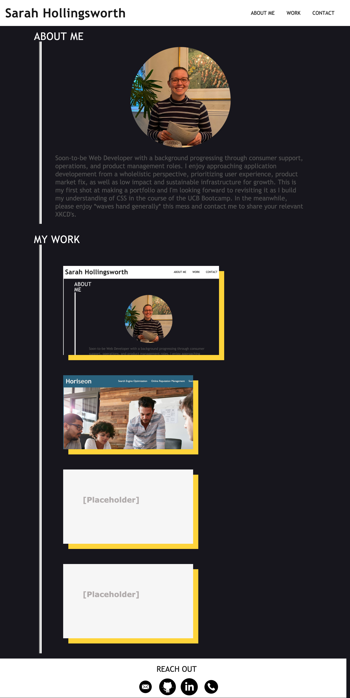

# Sarah Hollingsworth Portfolio Page
This is a portfolio page demonstrating my experience, projects, as well as sharing my contact information and some information about who I am. This is intented to serve as a resource for future potential employers to review to determine my potential fit for an available role. 

The second intention of this project was build it by focusing on leveraging advanced css tools.

## Deployed site
[Click here to visit my portfolio page.](https://sahhollingsworth.github.io/sarah-hollingsworth-portfolio_advanced-css/ "Sarah Hollingsworth")

## Summary

## Built with
* [HTML](https://developer.mozilla.org/en-US/docs/Web/HTML) - Used to create elements on the DOM
* [CSS](https://developer.mozilla.org/en-US/docs/Web/CSS) - Used to style html elements on the page
* [Git](https://git-scm.com/doc) - Used for version control system to track changes to source code
* [GitHub](https://docs.github.com/en) - Hosts the code repository

## Authors
Sarah Hollingsworth
* [Github](https://github.com/sahhollingsworth)
* [LinkedIn](https://www.linkedin.com/in/sarahhollingsworth/)

## Acknowledgments
* Icons from [the Noun Project](https://thenounproject.com/)
* Reset.css in public domain, found at [Meyer Web](http://meyerweb.com/eric/tools/css/reset/)
* Erik Kennedy:
  * [UI Design principles](https://twitter.com/erikdkennedy/status/1328771593934290944) helped guide some visual choices and I'll be exploring it further as I iterate on the portfolio's UI in the future.
  * [The Responsive Website Font Size Guidelines](https://learnui.design/blog/mobile-desktop-website-font-size-guidelines.html) article for better UI.